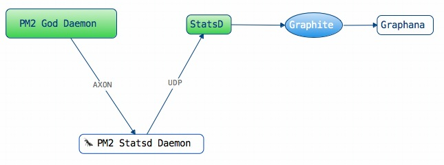

# pm2-ant
Unitech/PM2 performance monioring using Statsd and Graphite

> I am still working on this - trying to demerge it from the products.

## Why this?
I'm using PM2 to run thousands applications on dozens of servers, the performance of PM2 (maybe applications) is hard to track on production environment, e.g.:
- Restart, stop, start events of PM2
- CPU & Memory usages
- I/O frequency
- Network latency (Request / Response times, Apdex stuffs)
- Triggers (restart / stop warning - SMS / Email)

## How it works

## Requirement
- [Graphite](docs/graphite.md)

## License
Licensed under the Apache License, Version 2.0 (the "License");
you may not use this file except in compliance with the License.
You may obtain a copy of the License at

    http://www.apache.org/licenses/LICENSE-2.0

Unless required by applicable law or agreed to in writing, software
distributed under the License is distributed on an "AS IS" BASIS,
WITHOUT WARRANTIES OR CONDITIONS OF ANY KIND, either express or implied.
See the License for the specific language governing permissions and
limitations under the License.
